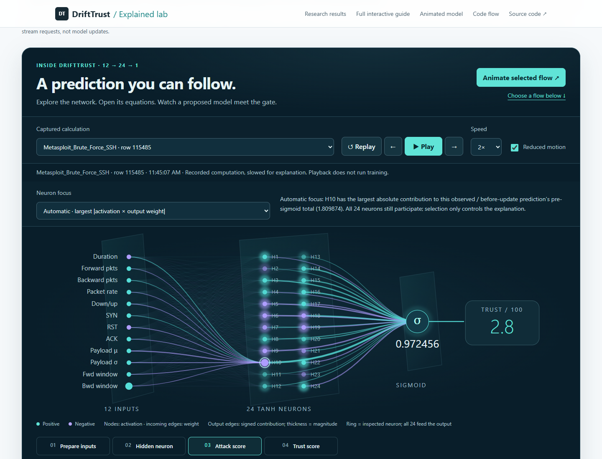
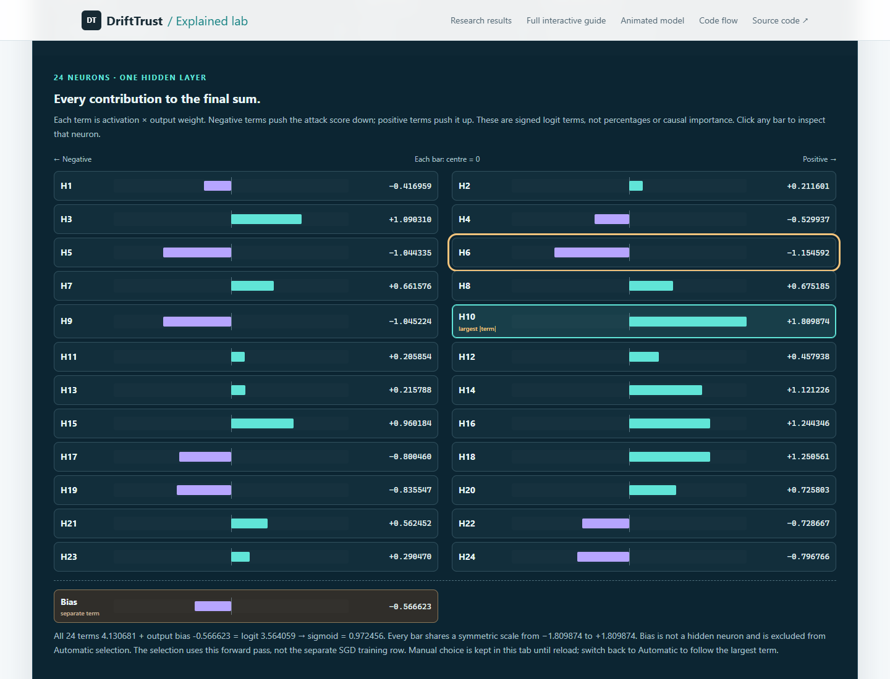
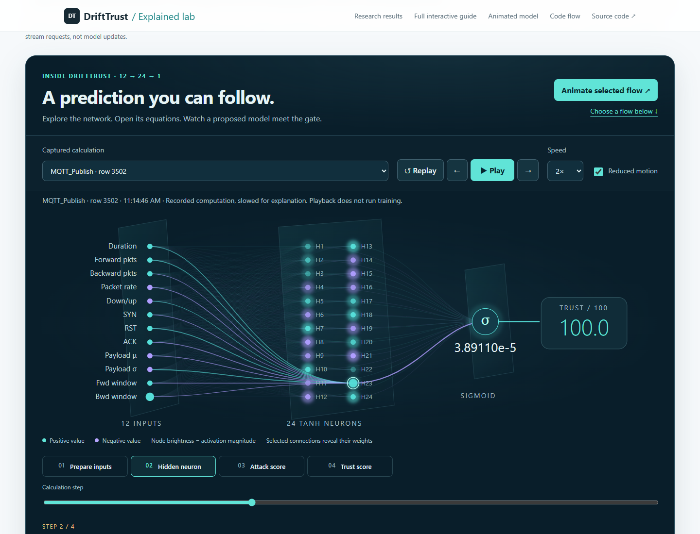
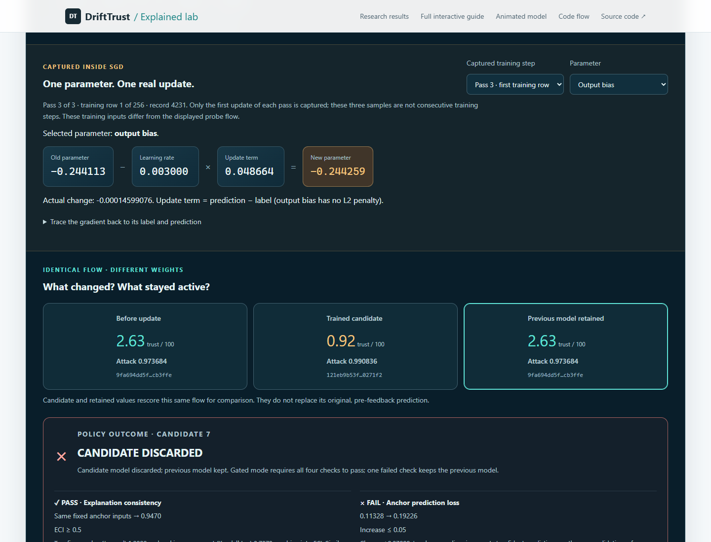

# Public animation verification

## Automatic and manual neuron focus update

Verified public application source [6ec2256](https://github.com/the-sudipta/drifttrust_audit/commit/6ec225653c21acc25f3d700c62afa56db1f1b38a) on 10 September 2026. [Current focus verification record](../neuron_focus_verification.json) includes both complete browser suites, 12 passing numerical tests, three successful GitHub workflows and deployed source hashes. All checks passed without browser runtime errors. The updated fieldbook contains 36 control/visual glossary entries.

Automatic focus selects H16 for initial-model Slowloris row 20635 and H10 for SSH row 115485. All 24 signed output connections participate and their chart includes bias separately. Every neuron remains manually inspectable: selection preserves prediction values, persists across runs/playback/model variants, and returns to the previous manual choice after switching through Automatic mode. Reload starts in Automatic mode. Numerical ranking tests also cover exact ties, zero terms and exclusion of bias.



Caption: Initial-model SSH row 115485, at the Attack score stage. H10 is selected because its activation × output-weight term has the largest absolute magnitude, approximately +1.80987. The inspector ring highlights H10 while all 24 output terms feed sigmoid. Positive output contributions are teal and negative contributions violet; neuron colour still denotes activation sign.



Caption: The same flow's additive logit terms, with a common symmetric scale and explicit zero for each bar. The 24 terms sum to approximately 4.13068; adding bias −0.56662 gives logit 3.56406 and attack score 0.972456. These are logit contributions, not probability percentages. Teal outlining marks the inspected neuron; a gold focus outline can mark the keyboard-focused control. Each neuron bar opens its existing equations in Manual mode.

## Initial animation release

Tested against the actual [GitHub Pages deployment](https://the-sudipta.github.io/drifttrust_audit/lab.html#mathTheatre) on 10 September 2026, using isolated Edge/Chromium browser profiles and published UCI example/replay data.

Tested application source: [2d88dbd](https://github.com/the-sudipta/drifttrust_audit/commit/2d88dbd19ca04ac481f483da8f3a800f96395775). Later evidence-only commits add this report and artifacts without changing that runtime. The [machine-readable report](../math_animation_verification.json) includes deployed asset hashes, timestamps, checks and CI links.

- All 11 numerical tests passed, including exact traced/untraced replay parity and all 337 parameters per captured learning step.
- Both public browser suites passed without runtime errors. Playback controls, numerical values, rejected-weight retention, activation with flags, exports, reload/reset, CSV input, audit verification and profile isolation were checked.
- Gated replay: 1,280 flows, 7 candidates, 4 activated, 3 discarded. Audit-only replay: 1,280 flows, 5 candidates, all activated.
- Nine fieldbook modules and the new 31-row control/visual glossary loaded successfully. Ten deployed source/assets matched the committed source after line-ending normalization.
- Layout checks covered 1440/820/390 CSS-pixel widths and an additional 200% root-font setting. This is not a complete accessibility or cross-browser certification.

## Actual browser screenshots

These are interface evidence, not additional scientific performance figures. The visualizations use real model values; apparent depth depicts the MLP layers, not a CNN.



Caption: A held-out MQTT flow passes through twelve transformed inputs, twenty-four tanh units and a sigmoid attack output. Teal/violet encode signs, not class labels. The displayed trust value rounds to 100.0 even though the attack score is nonzero; exported values retain full precision. Playback is paused at the hidden-neuron stage.



Caption: The first SGD row of pass three changes the output bias. The same held-out probe scores approximately 2.63 trust under the old model and 0.92 under the candidate. Gated candidate 7 is discarded because anchor loss increases beyond its permitted tolerance; the retained model's weights and score match the old model. This screenshot shows a sampled training step and historical candidate decision, not current network access enforcement.

## Numerical witness

[Download the actual exported candidate-7 trace](gated-candidate-7.json). It contains public replay measurements, model snapshots, sampled training updates and the AJR captured during the browser test. This artifact is inspectable local evidence, not independently notarized provenance.

From the repository root, save this as a temporary `.mjs` script and run it with Node 24 to check the weight fingerprints and sampled parameter updates:

```js
import fs from 'node:fs';
import assert from 'node:assert/strict';
import {digest} from './runtime/engine.mjs';
import {parameterStep} from './runtime/math-trace.mjs';
const {capture: t} = JSON.parse(fs.readFileSync(
  'assets/research/animation/gated-candidate-7.json'));
assert.equal(await digest(t.forward.model), t.record.model_before_sha256);
assert.equal(await digest(t.candidate.model), t.record.candidate_sha256);
assert.equal(await digest(t.active.model), t.record.active_model_sha256);
assert.equal(t.record.accepted, false);
assert.deepEqual(t.active.model, t.forward.model);
for (const step of t.steps) {
  for (const kind of ['w1', 'b1', 'w2', 'b2']) {
    for (let j = 0; j < (kind === 'w1' ? 12 : 1); j++) {
      for (let k = 0; k < (kind === 'b2' ? 1 : 24); k++) {
        const p = parameterStep(step, kind, j, k);
        assert.ok(Math.abs(p.before - p.lr * p.gradient - p.after) < 1e-12);
      }
    }
  }
}
console.log('Candidate fingerprints and all sampled updates verified.');
```

For independent gradient reconstruction and full replay comparison, run `node --test tests/*.test.mjs`. To repeat live interactions, use `tests/browser-math.cjs` and `tests/browser-pages.cjs` as described in the [complete animation guide](../MATH_ANIMATIONS.md). Device timestamps and record hashes can differ on another run; deterministic weights and policy outcomes are the relevant numerical checks.
